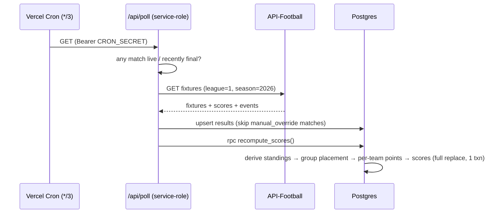
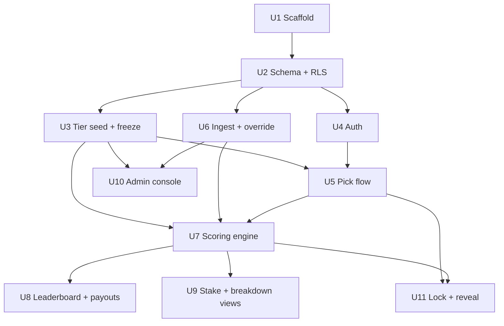

# feat: World Cup 2026 Fantasy Pool App

**Origin:** `docs/brainstorms/2026-05-31-world-cup-pool-requirements.md`
**Target ship:** picks open before the tournament opener, **June 11, 2026**.

---

## 0. Build & Operational Status (updated 2026-05-31, end of day)

**All 11 implementation units are code-complete, committed, and deployed.** 28 tests passing.

**Live resources:**
- **GitHub:** https://github.com/intrater/wc2026 (`main`, all work pushed)
- **App (public):** https://wc2026-pool-psi.vercel.app  (Vercel project `wc2026-pool`, deploy protection OFF)
- **Supabase project:** `wc2026-pool` (ref `qqdbhuyuoeetnulaxolv`) — migrations applied, 48 teams/12 tiers seeded, RLS verified
- **Secrets** live only in gitignored `.env.local` + Vercel encrypted env (Supabase keys, Gmail app password, etc.)

**Done & verified:**
- ✅ Scaffold, schema/RLS (live), scoring engine (18 tests), tiers seeded, leaderboard, pick flow, matches/stake/breakdown views, admin console
- ✅ Auth + email: Gmail SMTP wired for magic links + receipts; test sign-in email delivered; email templates customized
- ✅ All routes deploy and serve; `/pick` + `/admin` correctly gated

**Remaining to go fully live (pick up here):**
1. **API-Football key** — subscribe to Pro, set `API_FOOTBALL_KEY` in `.env.local` + Vercel, run a live sync (admin → "Sync results now" or `/api/poll`), then **verify team-name matching** and add any missing aliases in `lib/api-football/names.ts`. *(This is the one piece not yet tested end-to-end.)*
2. **Confirm sign-in round-trip** — tap the magic link, confirm it lands on `/pick` signed in.
3. **Admin one-time setup** (`/admin`): set the **kickoff lock time**; review the tier board and **freeze tiers** (⚠️ irreversible).
4. **Optional:** connect GitHub→Vercel for auto-deploy on push; add a custom domain.

---

## 1. Summary

A mobile-first web app that runs John's annual World Cup pool end-to-end, replacing the 2022 spreadsheet + Google Form. Players draft a 12-team roster (one team from each of 12 odds-based tiers), picks lock at kickoff and become public, results auto-ingest from API-Football, and an idempotent Postgres function recomputes everyone's points after each match. A public leaderboard with plain-English per-team breakdowns is the home base.

Stack is fixed and greenfield: **Next.js (App Router) on Vercel + Supabase (Postgres, Auth, RLS)**, with a **Vercel Cron** job driving result ingestion.

The single biggest correctness risk is the scoring engine. This plan front-loads a **Scoring Spec** (§5) that resolves every edge case the flow analysis surfaced, so the engine is built against an unambiguous, test-fixtured definition.

---

## 2. Problem Frame

- **2022 pain #1 — scores bunched:** everyone picked the same favorites, so standings clustered and ties were common. Fixed by 12 tiers × 4 teams with one forced pick per tier (4¹² ≈ 16.7M combinations) plus goal/upset bonuses that spread scores.
- **2022 pain #2 — all manual:** Google Form picks + hand-maintained spreadsheet. Fixed by in-app picks and automated scoring from a data feed.
- **New format:** 2026 is 48 teams / 12 groups / a new Round of 32, which the scoring ladder and tier structure are built for.

---

## 3. Scope Boundaries

### In scope
- 12-tier draft (seeded from current odds, admin-frozen), one pick per tier.
- Full scoring engine per §5 (group + escalating knockouts + underdog goal bonus + upset bonus).
- Name+email entry, magic-link editing, hidden-until-lock then public picks.
- API-Football ingest + admin manual override; **final-only** scoring (update on match completion, not live).
- Public leaderboard / standings (home base), per-team breakdown, browse all rosters, per-match "your stake" view.
- Manual Venmo; admin paid/unpaid toggle; auto-scaling pot + payouts (champion / runner-up / group-stage leader).
- Single admin (John).

### Deferred for later (from origin)
- Pre-game what-if / bracket projections.
- Broadcast email notifications (transactional email for magic links only).

### Outside this product's identity (from origin)
- Real payment integration (Stripe etc.) — payments stay manual Venmo.
- Public/stranger scale, hardened auth, anti-abuse — trusted ~25-person group.

### Deferred to Follow-Up Work (plan-local)
- Live/provisional in-match scoring (resolved to final-only for v1; live is a post-2026 enhancement).
- Odds-API integration (tiers seeded from a one-time odds pull instead).
- Per-tier goal-value scaling (kept flat by design).

---

## 4. Key Technical Decisions

| # | Decision | Rationale |
|---|----------|-----------|
| D1 | **Vercel Cron → `/api/poll` route handler** (not Supabase pg_cron) | Keeps ingest + scoring in one TS codebase with one secret set; Pro plan allows 1/min. `*/3 * * * *` during match windows is ample and conserves API quota. Guard with `CRON_SECRET`. |
| D2 | **Scoring computed in Postgres** as a single idempotent `recompute_scores()` RPC | Full recompute-from-source (`delete+insert` / upsert) is naturally idempotent — re-running after every poll can't double-count. Set-based SQL handles group standings/tiebreakers far more safely than imperative TS. No per-row triggers (they fire mid-batch on incomplete groups). |
| D3 | **Supabase Auth magic links** (`signInWithOtp`) via `@supabase/ssr` + middleware | Don't hand-roll token expiry/replay/cookies. RLS keys off `auth.uid()`. Use `getClaims()`/`getUser()` server-side, never `getSession()`. `@supabase/auth-helpers` is deprecated. |
| D4 | **RLS: private-until-timestamp-then-public** via a `stable` `is_locked()` helper | One SELECT policy: owner always, or anyone once `lock_at <= now()`. UPDATE policy gated on `not is_locked()`. Wrap the `lock_at` lookup in a `stable security definer` fn to avoid per-row re-query. |
| D5 | **Service-role key for ingest/scoring writes** (bypasses RLS); never shipped to client | Cron route writes results/scores server-side. RLS protects the browser path only. |
| D6 | **Tiers seeded from a one-time odds pull**, admin reviews/edits ties, clicks irreversible **freeze** | Tournament is ~11 days out; odds are effectively final. No recurring odds integration. Frozen tier drives all upset math forever. |
| D7 | **We compute group placement ourselves** from stored results (FIFA tiebreaker order), incl. the 8 best-third qualifiers | API standings used only as a cross-check; our computation is auditable and consistent with our scoring. |
| D8 | **Admin overrides are "sticky"** (`manual_override` flag per match) | A later API ingest must not clobber a hand-entered correction. |
| D9 | **Final-only scoring** (score on `FT`/`AET`/`PEN`, not live) | Resolved with user. Avoids provisional/VAR-reversal complexity; matches "check standings after the game." |

(See origin for product-level decisions: tier format, scoring shape, payouts, player flow.)

### 4.1 UX decisions (follow-up)

| # | Decision |
|---|----------|
| UX1 | **Leaderboard shows real names** (2022-style); no entry nicknames. |
| UX2 | **Playful, loud, festive visual style** (bold colors, big type, celebratory) — mobile-first. **Country flags shown next to every team** everywhere (tier board, picks, stake cards, breakdowns). |
| UX3 | **Short "How it works" explainer page** — essentials only (pick one per tier, how points are earned), not the full scoring spec. |
| UX4 | **Pre-lock, show who's joined + a running entry count** ("14 entered so far") as social proof — but **never** pick contents until lock. |
| UX5 | **Email a pick receipt** listing the 12 picks after submission (reuses magic-link email infra). |

---

## 5. Scoring Spec (engine source of truth)

This section is the test-fixture source of truth for `recompute_scores()` (U7). All point values are tunable constants in one config module.

### 5.1 Per-team group-stage points
- Draw = **1**; Win = **2**.
- Win your group (finish 1st) = **+3** (in lieu of the advance bonus — group winners do **not** also get +1).
- Advance to Round of 32 as **runner-up or qualifying best-third** = **+1**.
- Eliminated in group (4th, or non-qualifying 3rd) = **0** advance points.

### 5.2 Per-team knockout points (escalating, per win = advancing)
- R32 = **2**, R16 = **3**, QF = **5**, SF = **7**, Final win = **10**.
- "Win" = **the advancing team**, including via penalty shootout. Shootout loser gets nothing for the result.
- Third-place playoff: **no round-ladder points** (no slot in the ladder); goals/upsets from it still count (§5.3–5.4).

### 5.3 Goal bonus (tiers 7–12 only, flat)
- **+1 per goal scored**, only for teams in the **frozen** tiers 7–12.
- Counts: open-play + penalty-kick goals in regulation **and extra time**; own goals in the team's favor count toward its goals-for tally (we use the official match goals-for, matching the visible scoreboard).
- Excludes: penalty-**shootout** kicks (not "goals scored" in the match stat).

### 5.4 Upset bonus (all teams, stacks with everything)
- Beating a **higher-tier** team = **+1 per tier of the gap**; drawing a higher-tier team = **+0.5 per tier**.
- Uses the **frozen** tier number, always. Applies in group and knockout matches and **stacks** on top of result + round points. Example: frozen-Tier-10 beats frozen-Tier-3 in R16 → 3 (round) + 7 (upset) = 10.
- A KO match level after 120' but won on penalties = treated as a **win** for upset purposes (team advanced).
- Favorite beating/ drawing a lower-or-equal tier = **0** upset (gap ≤ 0).

### 5.5 Match-status handling at ingest
- Score only on terminal status: `FT`, `AET`, `PEN`.
- `AWD`/`WO` (awarded/walkover): treat as a win for the awarded side using the official awarded score for goal/upset purposes.
- `PST`/`CANC`/`ABD`/in-progress: score nothing until resolved or admin override.
- Unknown `round` string → **fail loudly**, flag match "needs admin attention" (never silently score as group).

### 5.6 Prizes & tiebreakers
- Pot = **$100 × current paid count**, displayed live, finalized at tournament end. Split **champion 60% / runner-up 25% / group-stage leader 15%** (tunable).
- **Group-stage leader** = most points earned in group-stage matches (result + group bonus + goal + upset), frozen at end of group play.
- **Overall tiebreaker:** (1) total points → (2) most points from frozen tiers 7–12 → (3) most total upset points → (4) split the prize.

### 5.7 "Owning both teams in one match"
- Scoring is strictly per-team and sums independently (both your teams score their own points; your underdog beating your favorite earns you upset points while your favorite loses its win — net is just the sum).
- UI must explicitly label "both your teams here" (§U9).

---

## 6. High-Level Technical Design

*Directional guidance for review, not implementation specification. The implementing agent should treat it as context, not code to reproduce.*



Data flow for scoring (all derived from source-of-truth `results` + frozen `tiers` + `picks`):
`results` → `standings` (computed) → group placement (winner / runner-up / best-thirds) → per-team points (§5) → `scores` (rewritten each run).

---

## 7. Output Structure

```text
wc2026/
├── app/
│   ├── (public)/
│   │   ├── page.tsx                 # Leaderboard / standings (home base)
│   │   ├── rosters/page.tsx         # Browse all entries (post-lock)
│   │   ├── matches/page.tsx         # Schedule + your-stake cards
│   │   ├── entry/[id]/page.tsx      # Per-entry roster + breakdown
│   │   └── how-it-works/page.tsx    # Short rules explainer (UX3)
│   ├── pick/                        # Pick flow (create + edit)
│   ├── admin/                       # Admin console (gated)
│   ├── api/
│   │   ├── poll/route.ts            # Cron-driven ingest + recompute
│   │   └── auth/confirm/route.ts    # Magic-link callback
│   └── layout.tsx
├── lib/
│   ├── supabase/{server,client,middleware}.ts
│   ├── scoring/{spec,constants}.ts  # mirrors §5 constants; SQL is authoritative
│   ├── api-football/{client,rounds}.ts
│   └── tiers/seed.ts                # current-odds seed data
├── supabase/migrations/            # schema + RLS + recompute_scores()
├── middleware.ts                   # auth token refresh
└── vercel.json                     # cron config
```

The per-unit **Files** lists below are authoritative; this tree is the expected shape.

---

## 8. Implementation Units

Dependency graph:



---

### U1. Project scaffold & deployment config

**Goal:** Bootable Next.js App Router app on Vercel with Supabase wired and secrets configured.
**Requirements:** Enables all subsequent units.
**Dependencies:** none.
**Files:** `package.json`, `next.config.ts`, `vercel.json`, `lib/supabase/{server,client,middleware}.ts`, `middleware.ts`, `.env.example`.
**Approach:** Next.js + TypeScript + Tailwind. Install `@supabase/ssr`, `@supabase/supabase-js`. Create browser + server Supabase clients with `getAll/setAll` cookie handlers. Add `middleware.ts` for token refresh. `vercel.json` cron `{ "path": "/api/poll", "schedule": "*/3 * * * *" }`. Document env: `NEXT_PUBLIC_SUPABASE_URL`, `NEXT_PUBLIC_SUPABASE_ANON_KEY`, `SUPABASE_SERVICE_ROLE_KEY`, `API_FOOTBALL_KEY`, `CRON_SECRET`.
**Patterns to follow:** Supabase "Server-Side Auth for Next.js" current docs (`@supabase/ssr`, not `auth-helpers`).
**Test scenarios:** `Test expectation: none -- scaffolding/config; verified by app boot + a smoke request to a placeholder route.`
**Verification:** App boots locally and on a Vercel preview; server + browser Supabase clients construct without error.

---

### U2. Database schema & RLS

**Goal:** All tables, constraints, and RLS policies the app needs.
**Requirements:** Data model for entries, picks, tiers, results, scores, settings; security per D4/D5.
**Dependencies:** U1.
**Files:** `supabase/migrations/0001_schema.sql`, `supabase/migrations/0002_rls.sql`, `lib/db/types.ts`.
**Approach:** Tables: `teams`, `tiers(tier_no, team_id, frozen bool)`, `settings(lock_at, tiers_frozen_at, tournament_complete bool, payout_split)`, `profiles(user_id, is_admin)`, `entries(id, user_id, display_name, email, paid bool, submitted_at)`, `picks(entry_id, tier_no, team_id)` (unique on `(entry_id, tier_no)`), `matches(fixture_id pk, round, group_label, home_team, away_team, status, home_goals, away_goals, winner, manual_override bool, needs_attention bool)`, `scores(entry_id, total, group_stage_total, underdog_total, upset_total, updated_at)`, `score_lines(entry_id, team_id, match_id, points, label)` for breakdowns. RLS per D4: `is_locked()` `stable security definer`; picks SELECT owner-or-locked; picks INSERT/UPDATE owner-and-not-locked; admin policies on `matches`/`entries.paid`/`tiers` via `is_admin` JWT claim or `profiles` lookup. Enable RLS on every table.
**Patterns to follow:** Supabase RLS guide; `stable` helper to dodge per-row subquery cost.
**Test scenarios:**
- Owner can SELECT own picks before lock; a different user cannot (pre-lock).
- After `lock_at`, any authenticated user can SELECT all picks.
- UPDATE to own picks succeeds pre-lock, is rejected post-lock (`WITH CHECK`).
- Non-admin cannot write `matches` or toggle `entries.paid`; admin can.
- `picks` rejects a second row for the same `(entry_id, tier_no)`.
- Service-role client bypasses RLS for result/score writes.
**Verification:** Policy tests pass against a local Supabase; unique constraints enforced.

---

### U3. Tier seeding & admin freeze

**Goal:** Seed the 12×4 tier board from current odds; admin reviews, resolves odds ties, and freezes irreversibly.
**Requirements:** §4 tier format; D6, D7 (frozen tier).
**Dependencies:** U2.
**Files:** `lib/tiers/seed.ts`, `app/admin/tiers/page.tsx`, `app/admin/tiers/actions.ts`.
**Approach:** Seed data = 48 teams + current championship odds (from origin §4 snapshot). App sorts into 12 tiers of 4. Admin screen shows the board, lets John reorder tied-odds teams (enforce exactly 4 per tier), and a **Freeze** action sets `tiers.frozen=true` + `settings.tiers_frozen_at`. Freeze is irreversible and admin-gated. Upset math reads frozen tier only.
**Patterns to follow:** Server Actions with admin auth check.
**Test scenarios:**
- Seed produces exactly 12 tiers × 4 teams (48 total, no dupes).
- Reordering tied teams preserves the 4-per-tier invariant; an invalid arrangement is rejected.
- Freeze sets the flag + timestamp; a second freeze attempt is a no-op/blocked.
- Non-admin cannot view or freeze.
- Post-freeze, tier edits are rejected.
**Verification:** A frozen 12×4 board exists; every team maps to exactly one tier.

---

### U4. Magic-link authentication

**Goal:** Passwordless sign-in/identity for pick submission and editing.
**Requirements:** Player flow (name+email, edit via emailed link); D3.
**Dependencies:** U2.
**Files:** `app/api/auth/confirm/route.ts`, `app/pick/login/page.tsx`, `lib/supabase/server.ts` (auth helpers), `app/admin/_auth.ts`.
**Approach:** `signInWithOtp({ email, options: { data: { display_name }, emailRedirectTo } })`; callback route exchanges code for session (PKCE default). Store `display_name` in user metadata + `entries`. Server-side gating via `getClaims()`/`getUser()`. Admin = `is_admin` claim/`profiles` row.
**Patterns to follow:** Supabase Next.js magic-link quickstart; never trust `getSession()` server-side.
**Test scenarios:**
- Requesting a link for a new email creates a session on confirm and persists `display_name`.
- Returning via a fresh link resolves to the same user/entries.
- Expired/used link is rejected gracefully.
- Server route protected by `getUser()` rejects an unauthenticated request.
- Admin-only route rejects a non-admin session.
**Verification:** End-to-end magic-link round trip works on a preview deploy; sessions refresh via middleware.

---

### U5. Pick flow (create, draft, submit, edit)

**Goal:** Mobile-first one-pick-per-tier entry with autosave, submit, pre-lock editing, and an emailed receipt. (Moment 1.)
**Requirements:** Origin §7 Moment 1; one pick per tier; hidden until lock; lock enforcement; UX2 (flags), UX5 (receipt).
**Dependencies:** U3 (frozen tiers), U4 (identity).
**Files:** `app/pick/page.tsx`, `app/pick/actions.ts`, `app/pick/_components/TierPicker.tsx`, `lib/entries/validate.ts`, `lib/email/receipt.ts`, `app/(public)/how-it-works/page.tsx`.
**Approach:** Tier-by-tier picker (12 rows × 4 teams) with **country flags** on each team (UX2). Tap one per tier. Draft autosaves to `picks` (partial allowed pre-submit). Submit requires all 12 (`validate.ts`), then **emails a receipt** of the 12 picks (UX5, via U4 email infra). Edits allowed until `lock_at`; **all** pick writes server-side reject when `now >= lock_at` (defense beyond RLS). One email may own multiple entries; magic link resolves to a specific entry. Picks private pre-lock (RLS). Includes the short **"How it works"** explainer page (UX3).
**Patterns to follow:** Server Actions; optimistic mobile UI.
**Test scenarios:**
- Selecting a second team in the same tier replaces the first (one-per-tier).
- Submit blocked until all 12 tiers filled; clear which are missing.
- Draft persists and resumes via magic link.
- Pick write after `lock_at` is rejected server-side even with a stale client.
- A user cannot read/edit another user's entry pre-lock.
- One email creating a second entry yields a distinct entry id.
- On successful submit, a receipt email listing the 12 picks is sent.
- Each team renders with its correct country flag.
**Verification:** A complete 12-team entry submits, is editable pre-lock, frozen at lock.

---

### U6. API-Football ingest & manual override

**Goal:** Pull fixtures/results into `matches`; map rounds; support sticky admin overrides.
**Requirements:** §5.5 status handling; §5.2 round ladder; D1, D8; origin §8.
**Dependencies:** U2.
**Files:** `app/api/poll/route.ts`, `lib/api-football/client.ts`, `lib/api-football/rounds.ts`, `app/admin/results/page.tsx`, `app/admin/results/actions.ts`.
**Approach:** `/api/poll` validates `Authorization: Bearer CRON_SECRET`, checks if any fixture is live/recently final (skip API call otherwise to save quota), fetches `fixtures?league=1&season=2026`, upserts `matches` keyed on `fixture_id`. **Skip** matches with `manual_override=true`. Map `round` string → enum (`rounds.ts`); unknown → set `needs_attention`, do not score. Respect rate-limit headers. Admin results screen: edit a score/winner → sets `manual_override=true`; clearing the flag re-enables ingest. After upsert, call `rpc('recompute_scores')`.
**Patterns to follow:** Service-role Supabase client; defensive empty-array handling (API returns `200` + `[]` for missing data).
**Test scenarios:**
- Poll without/with wrong `CRON_SECRET` is rejected; correct one proceeds.
- A `FT` fixture upserts correct goals/winner; an in-progress fixture is stored but not scored.
- A match with `manual_override=true` is **not** overwritten by a later ingest.
- Unknown round string sets `needs_attention` and does not score as group.
- `AWD`/`WO` recorded with awarded score; `PST`/`CANC` score nothing.
- Admin override updates the score and triggers recompute.
**Verification:** Against recorded API fixtures, `matches` reflects correct status/score/round; overrides survive re-ingest.

---

### U7. Scoring engine — `recompute_scores()`

**Goal:** Idempotent full recompute implementing the entire Scoring Spec (§5).
**Requirements:** §5 in full; D2, D7.
**Dependencies:** U6 (results), U3 (frozen tiers), U5 (picks).
**Files:** `supabase/migrations/0003_recompute.sql`, `lib/scoring/constants.ts`, `supabase/migrations/0004_standings_view.sql`.
**Approach:** Single SQL function, one transaction: (1) derive `standings` from terminal `matches` with FIFA tiebreaker `ORDER BY`; (2) compute group placement — winner, runner-up, and the 8 best-thirds across 12 groups (D7); (3) per team on each roster compute group points (§5.1), knockout points (§5.2), goal bonus for frozen tiers 7–12 (§5.3), upset bonus by frozen-tier gap (§5.4); (4) rewrite `scores` + `score_lines` (full replace, never incremental). Constants mirrored in `constants.ts` for UI labels; SQL is authoritative.
**Execution note:** Build test-first against worked-example fixtures before wiring to live data.
**Patterns to follow:** Set-based aggregation; deterministic `ORDER BY` for tiebreakers.
**Technical design:** *Directional.* Inputs (`results`, frozen `tiers`, `picks`) → derived `standings` → placement → per-`(entry,team,match)` `score_lines` → aggregated `scores`. Running twice on identical inputs yields identical output.
**Test scenarios (worked examples = correctness backbone):**
- Group: win/draw/loss point totals; group winner gets +3 (not +1); runner-up +1; non-qualifying 3rd 0.
- Best-third qualifier: 8 of 12 thirds correctly flagged via tiebreakers; the 9th-ranked third gets 0 advance.
- Knockout ladder values R32→Final; shootout winner gets round win points, loser 0.
- Goal bonus only for frozen tiers 7–12; extra-time goal counts; shootout kick does **not**.
- Upset: Tier-10 beats Tier-3 in R16 = 3 + 7 = 10 (stacking); higher beats lower = 0 upset; draw vs higher = +0.5/tier (produces .5 totals).
- Own goal in favor counts toward goals-for tally for goal bonus.
- "Both your teams" match: per-team sums net correctly.
- Idempotency: running the function twice produces byte-identical `scores`.
- Downward revision: replacing a result with fewer goals reduces totals on recompute (no residue).
- `AWD` match scored with awarded score; `PST` contributes nothing.
- Tiebreaker order: equal totals resolved by tier-7–12 points, then upset points.
**Verification:** All worked-example fixtures pass; double-run is identical; group placement matches a hand-computed bracket.

---

### U8. Leaderboard, standings & payouts

**Goal:** Public home-base leaderboard with breakdown totals, paid flags, pot + payout display, and a pre-lock "who's joined" state. (Moment 3 core.)
**Requirements:** Origin §7 Moment 3, §9; §5.6 prizes/tiebreakers; unpaid handling (shown+flagged); UX1 (real names), UX4 (pre-lock entrants + count).
**Dependencies:** U7.
**Files:** `app/(public)/page.tsx`, `app/(public)/_components/{LeaderboardRow,PotSummary,JoinedList}.tsx`, `lib/payouts/calc.ts`.
**Approach:** Default landing route. **Real names** (UX1). **Pre-lock**, render a "who's joined + count" list (UX4) instead of rankings — entrant names + "N entered so far", **no pick contents**. Post-lock, rank by §5.6 tiebreakers; show total, group-stage total, paid/unpaid badge. Unpaid-but-complete entries shown, flagged, **excluded from pot** until `paid=true`; pot = `$100 × paid count`, payouts 60/25/15 auto-scaled and recomputed live. Group-stage-leader prize frozen at end of group play.
**Patterns to follow:** Server Components reading `scores`; phase gating from U11.
**Test scenarios:**
- Pre-lock view shows entrant names + count, never pick contents.
- At/after lock, view switches to ranked leaderboard.
- Ranking respects total → tier-7–12 → upset tiebreakers.
- Unpaid entry appears with badge and is excluded from pot; toggling paid rescales pot and payouts.
- Pot = $100 × paid count; splits sum to pot.
- Group-stage-leader reflects group-only points and freezes after group play.
**Verification:** Leaderboard matches engine output; pot/payout math correct across paid-count changes.

---

### U9. Stake & breakdown views

**Goal:** Per-match "your stake" (Moment 2), per-team point breakdown, and browse-all-rosters (Moment 3 social).
**Requirements:** Origin §7 Moments 2 & 3, §5.7; per-team detail.
**Dependencies:** U7.
**Files:** `app/(public)/matches/page.tsx`, `app/(public)/_components/StakeCard.tsx`, `app/(public)/entry/[id]/page.tsx`, `app/(public)/rosters/page.tsx`, `lib/scoring/explain.ts`.
**Approach:** For a viewer's entry, each fixture shows: which of their teams play, a per-team "goals score you points" flag for frozen tiers 7–12, and an explicit "both your teams" / "no team here" state. Post-match, `score_lines` render a plain-English breakdown (`explain.ts`): e.g., "+4 Senegal — 2 (win) + 2 (2 goals)"; half-points shown as `.5`. Browse-all-rosters available post-lock.
**Patterns to follow:** Reuse `score_lines`; tier-based flags from frozen tiers.
**Test scenarios:**
- Stake card shows the correct owned team(s); goal-bonus flag only on tiers 7–12 teams.
- "Both your teams" and "no team here" states render correctly.
- Breakdown lines match `score_lines` including upset and half-point cases.
- All rosters browseable only after lock; blocked before.
- Eliminated team marked with frozen final total.
**Verification:** A viewer can, for any match, see their stake in ~3 seconds and a correct post-match breakdown.

---

### U10. Admin console

**Goal:** One place for John to manage the pool: paid toggle, result override, tier freeze, lock control.
**Requirements:** Admin (sole); paid tracking; override; freeze; lock.
**Dependencies:** U3, U6.
**Files:** `app/admin/page.tsx`, `app/admin/entries/page.tsx`, `app/admin/entries/actions.ts`, `app/admin/settings/actions.ts`.
**Approach:** Admin-gated (U4). Entries list with paid/unpaid toggle. Results override (U6). Tier freeze (U3). Settings: set `lock_at`, mark tournament complete (or auto on Final `FT`). Surfaces `needs_attention` matches.
**Patterns to follow:** Server Actions with admin claim check on every mutation.
**Test scenarios:**
- Paid toggle flips `entries.paid` and rescales pot.
- Setting `lock_at` is reflected in `is_locked()`.
- `needs_attention` matches are listed for resolution.
- Every admin mutation rejects a non-admin caller.
**Verification:** John can run the full pool lifecycle from the console.

---

### U11. Lock & reveal state machine

**Goal:** Enforce the three lifecycle states: pre-lock (picks open, private), locked (public, scoring), complete (frozen, payouts).
**Requirements:** Origin §6 lock + reveal; state transitions; no-reopen rule.
**Dependencies:** U5, U7.
**Files:** `lib/state/phase.ts`, `app/(public)/_components/RevealGate.tsx`, plus guards in `app/pick/actions.ts`.
**Approach:** Derive phase from `settings.lock_at` / `tournament_complete`. Pre-lock: picks editable, others' picks hidden (RLS + UI gate); public view shows the "who's joined + count" state (UX4), not a reveal placeholder. At `lock_at`: all picks/rosters public; pick writes rejected. **Picks never reopen** for anyone (admin override is results-only). Complete: auto when Final is `FT` (admin can still override results); leaderboard final, payouts shown.
**Patterns to follow:** Single source of truth for phase; server-enforced, not client-trusted.
**Test scenarios:**
- Before `lock_at`: others' picks hidden; "who's joined + count" shown (no pick contents).
- At/after `lock_at`: rosters public; pick edits rejected; no reopen path exists.
- Complete state freezes leaderboard; ingest/recompute still allowed for late corrections via override.
- Phase derivation correct at the exact lock second (boundary).
**Verification:** App visibly changes shape at kickoff; no path reopens picks post-lock.

---

## 9. System-Wide Impact

- **Security:** service-role key server-only; RLS the sole browser-path guard; admin claim checked on every mutation; `CRON_SECRET` on the poll route.
- **Cost/quota:** API-Football Pro (~$19/mo) subscribed direct; quota-aware polling (skip when no live matches). Vercel Pro cron. Supabase free/low tier sufficient at 25 users.
- **Correctness:** the Scoring Spec (§5) + U7 fixtures are the backbone; group-placement and idempotency are the highest-risk areas.

---

## 10. Risk Analysis & Mitigation

| Risk | Impact | Mitigation |
|------|--------|-----------|
| API-Football lags/wrong on the new format | Wrong/late standings | Sticky admin override (U6/D8); manual entry fallback always available. |
| Best-third qualifier logic wrong | Wrong advance points | Compute ourselves (D7), hand-verified fixture in U7; admin can override matches. |
| Recompute double-counts | Inflated scores | Full-replace idempotent design (D2); double-run test (U7). |
| Tight 11-day timeline | Miss opener | Build order U1→U5 first delivers a working pick flow; ingest/scoring (U6/U7) can fall back to manual entry if the feed isn't ready. |
| RLS misconfig leaks picks pre-lock | Fairness break | Explicit RLS tests (U2); UI reveal gate + server checks (U11). |

---

## 11. Deferred to Implementation

- Exact poll cadence per match window (config value; dynamic by kickoff time).
- Final FIFA tiebreaker chain details for ranking thirds (encode in U7 `ORDER BY`; confirm against the official 2026 rule on first knockout day).
- Email template copy for magic links.
- Exact mobile pick-flow interaction polish.

---

## 12. Build Order

1. **U1 → U2 → U4 → U3 → U5** — a deployable app where players submit and edit 12-team entries (works even before the feed exists).
2. **U6 → U7** — ingest + scoring engine (the correctness core; test-first).
3. **U8 → U9 → U11** — public leaderboard, stake/breakdown views, lock/reveal.
4. **U10** — admin console (can be built incrementally alongside U3/U6).
